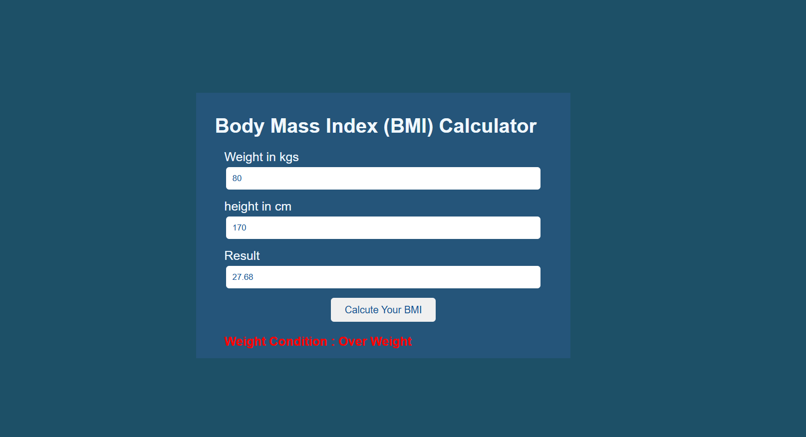

# 🧮 BMI Calculator Web App

A simple and responsive Body Mass Index (BMI) Calculator built using **HTML, CSS, and JavaScript**.  
This project calculates BMI based on user input (weight and height) and instantly displays the result along with the corresponding weight condition using dynamic color styling.

---

## 🚀 Features
- 📏 Calculates BMI using height (cm) and weight (kg)
- ⚡ Instant result display
- 🎨 Dynamic color indication based on BMI category
- 💻 Clean and responsive user interface
- 🔢 Real-time mathematical computation
- 🖱️ Interactive button hover and click animations
- 🧠 Built with pure JavaScript (No frameworks)

---

## 🛠️ Technologies Used
- HTML5
- CSS3 (Flexbox & Transitions)
- JavaScript (Vanilla JS)

---

## 📂 Project Structure
```
BMI-Calculator/
│
├── index.html
├── style.css
├── script.js
└── README.md
```

---

## ⚙️ How It Works
1. The user enters their **weight in kilograms**.
2. The user enters their **height in centimeters**.
3. JavaScript converts height from centimeters to meters.
4. BMI is calculated using the formula:
   ```
   BMI = weight / (height in meters)^2
   ```
5. The calculated BMI value is displayed in a read-only input field.
6. The weight condition is shown below the button with color indication:
   - Under Weight → Red
   - Normal Weight → Green
   - Over Weight → Red
   - Obese → OrangeRed

---

## 🧮 BMI Classification

| BMI Range        | Condition       |
|------------------|----------------|
| Less than 18.5   | Under Weight   |
| 18.5 – 24.9      | Normal Weight  |
| 25 – 29.9        | Over Weight    |
| 30 and above     | Obese          |

---

## ▶️ How to Run the Project
1. Download or clone the repository:
   ```
   git clone https://github.com/your-username/bmi-calculator.git
   ```
2. Open the project folder.
3. Open `index.html` in your browser.

No installations or dependencies required.

---

## 🖼️ Screenshot
```

```

---

## 🎯 What I Learned
- DOM Manipulation
- Handling user input validation
- Mathematical operations in JavaScript
- Conditional statements
- Dynamic styling using JavaScript
- Event listeners and interactivity

---

## 📌 Future Improvements
- Add custom error message UI instead of alert
- Add Enter key support
- Add reset button
- Add BMI chart visualization
- Store BMI history using LocalStorage
- Add animations to result display
- Convert project to React
- Deploy using GitHub Pages

---

## 👨‍💻 Author

Takundah Gorogodo  

CSE Student | Machine Learning Enthusiast  
---

## 📄 License

This project is open-source and available for learning and educational purposes.
